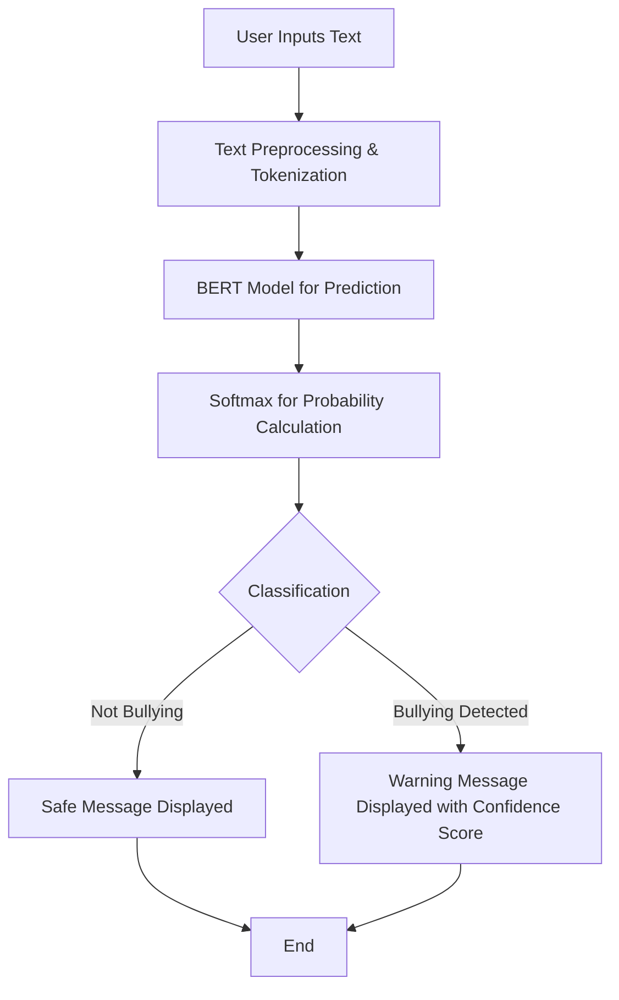

# **Cyberbullying Detection System**

## **📌 Introduction**
Cyberbullying is a growing concern in the digital age, affecting millions of users worldwide. This project aims to detect cyberbullying content in text messages using **Natural Language Processing (NLP)** and **Deep Learning** with a **BERT-based classification model**.

## **🎯 Objectives**
- Develop an **AI-powered text classification model** for cyberbullying detection.
- Utilize **BERT (Bidirectional Encoder Representations from Transformers)** for accurate predictions.
- Create a **Streamlit-based web application** for user interaction.
- Display **confidence scores** along with predictions.
- Aid social media platforms and educational institutions in identifying harmful content.

---

## **⚙️ System Architecture**

### **Flowchart**


### **System Components**


---

## **🛠️ Technologies Used**

| **Technology** | **Purpose** |
|--------------|-------------|
| **Streamlit** | Web interface for user interaction |
| **BERT Model** | NLP-based deep learning model for text classification |
| **PyTorch** | Framework for model loading, training, and inference |
| **asyncio** | Handles event loops for Windows compatibility |
| **Softmax Activation** | Converts model logits into probability scores |
| **OS Module** | Manages system-related operations |

---

## **🚀 Implementation**

### **Step 1: User Input & Tokenization**
- The user enters a text message in the **Streamlit** interface.
- The **BERT model** tokenizes the text, converting it into numerical format.

### **Step 2: Model Processing**
- The **pre-trained BERT model** classifies the text using **deep learning**.
- The model is loaded using **PyTorch**.

### **Step 3: Probability Calculation**
- The output logits from the model are converted into **probability scores** using the **Softmax function**.
- The class with the highest probability is selected as the **final prediction**.

### **Step 4: Output Display**
- If the text is safe, the system displays **"Not Bullying"** with a green success message.
- If cyberbullying is detected, a **warning message** appears with a **confidence score**.

---

## **💡 Key Features**
✅ **Real-time text analysis**    
✅ **BERT-based deep learning model** for high accuracy    
✅ **Interactive UI** using Streamlit    
✅ **Confidence score display**    
✅ **Easy deployment**    

---

## **🔮 Future Enhancements**
🔧 **Improve explainability** by highlighting bullying-related words.        
🔧 **Fine-tune the model** with larger real-world datasets.    
🔧 **Multi-language support** using **mBERT**.    
🔧 **Deploy as an API** for real-time monitoring in social media applications.    

---

## **🔧 Installation & Setup**
### **1️⃣ Clone the Repository**
```bash
git clone https://github.com/yourusername/cyberbullying-detection.git
cd cyberbullying-detection
```

### **2️⃣ Install Dependencies**
```bash
pip install -r requirements.txt
```

### **3️⃣ Run the Application**
```bash
streamlit run app.py
```

---

## **📌 Example Usage**
Enter a text message in the Streamlit interface and click **"Analyze Text"**. The model will predict whether the text contains cyberbullying content and display a confidence score.

---

## **📖 References**
1. Devlin, J., Chang, M., Lee, K., & Toutanova, K. (2019). *BERT: Pre-training of Deep Bidirectional Transformers for Language Understanding*.
2. PyTorch Documentation: [https://pytorch.org/](https://pytorch.org/)
3. Streamlit Documentation: [https://streamlit.io/](https://streamlit.io/)


